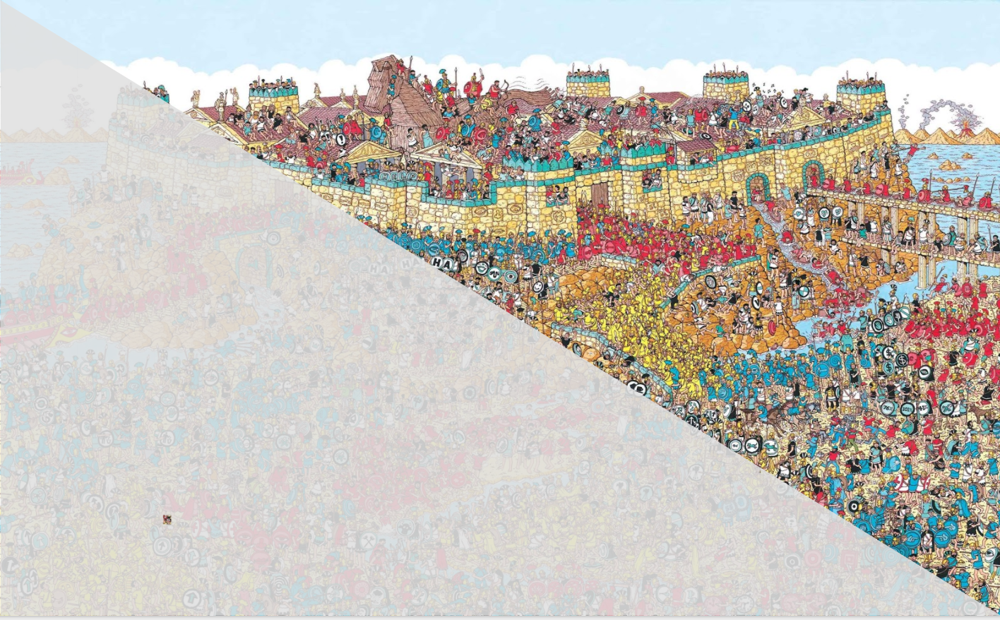

# There's Waldo!

This repository contains an implementation of the fully convolutional [Tiramisu](https://arxiv.org/abs/1611.09326) network for semantic segmentation, applied to the task of playing **Where's Waldo?**.

Where’s Waldo (or Wally) is a series of children’s books that challenges the reader with finding the eponymous character and his compadres in densely illustrated images.

<figure>
  
  <figcaption>Actual Predicted Segementation Indicated by Transparency Mask</figcaption>
</figure>

Please see my recent blog post [Where's Waldo: Terminator Edition]() for an overview of my approach.

I've also provided a complete end-to-end walk-through of my There's Waldo project [in this notebook](http://nbviewer.jupyter.org/github/bckenstler/TheresWaldo/blob/master/theres_waldo.ipynb). 

You can find all training / testing images and corresponding predictions [here](https://www.flickr.com/photos/153621475@N06/albums/72157684946674930)

## Set Up

I've provided for you the original images and bounding box xml's necessary to recreate my process.

To create the binary labels:

```shell
$ python make_targets.py
```

The next step is to create the Waldo sub-images.

```shell
$ python create_subimages.py
```

## Training

I didn't put together a script for training the model; training neural networks isn't straightforward and relies alot on human judgement. If you'd like to train your own model, please take a look at the accompanying notebook.

## Predicting 

To make predictions on new images:

```shell
$ python predict.py image1.py image1.py --output_path /output/path
```
This will load weights from my model by default. Makes predictions and saves them as transparency masks overlaid on the original image. They'll be saved as `output_{i}.png` in the specified folder.

If you want to use your own model weights, just specify with the `--model` flag.

## Acknowledgments

This project is inspired by material studied while interning with Jeremy Howard and Rachel Thomas' [fast.ai](fast.ai), in particular Lesson 14 of their course [Cutting Edge Deep Learning for Coders](http://course.fast.ai/part2.html), taught at USF’s [Data Institute](https://www.usfca.edu/data-institute).
